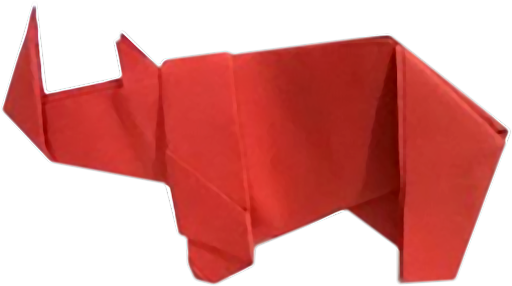

<p align="center">

</p>

# folded
Folded: an ImageJ/Fiji toolkit to describe mammalian herbivore dentition from 2D images

**Authors**: [Oscar Sanisidro](https://scholar.google.es/citations?user=TLYIuyEAAAAJ&hl=es), [Ignacio Arganda-Carreras](https://www.ikerbasque.net/en/ignacio-arganda-carreras), and [Juan L. Cantalapiedra](https://scholar.google.es/citations?hl=es&user=19hBfQ8AAAAJ)

## Installation instructions
‘folded’ is a script of the open-source image processing software [Fiji](https://fiji.sc/), which is, in turn, a distribution of [ImageJ](http://rsb.info.nih.gov/nih-image). ‘folded’ has been scripted in the BeanShell language.
### Fiji installation
You can find the latest version of Fiji in the following [link](https://imagej.net/software/fiji/) together with the installation instructions and system requirements for the current version. At the moment of this publication Fiji is supported for Windows XP, Vista, 7, 8, 10, 11, etc. (in both 32 and 64-bit versions), Mac OS X 10.8 “Mountain Lion” or later, and Linux on amd64 and x86 architectures. To make sure the latest version is installed, it is recommended to run the [Updater](https://imagej.net/plugins/updater) when the program is executed for the first time. The update option can be found in the [Help / Update...] menu.

### Installing dependencies
‘folded’ makes use of two plugins that are not included in the base Fiji distribution. These are: [‘OrientationJ’](http://bigwww.epfl.ch/demo/orientation/) and [‘MorphoLibJ’](https://imagej.net/plugins/morpholibj). To install them,

1. Go to the [Help > Update...] menu
2. Select ‘Manage update sites’
3. From the list within, select ‘BIG-EPFL’ and ‘IJPB-plugins’
4. Click on 'Close'
5. Click on ‘Apply changes’
6. Restart Fiji.

Additional information on how to install plugins in Fiji manually can be found in the following link: https://imagej.net/plugins/.

### 'folded' script installation
Once Fiji and the two auxiliary plugins are installed, the file ‘folded_.bsh’ can be downloaded from the [Github repository](https://github.com/iarganda/folded). Next, copy the file to the directory \<Fiji root\>/plugins/Scripts/Plugins/Analyze/ (you may need to create it) and restart Fiji. The script then appears as a new command under the menu [Plugins/Analyze] (in the last position of the menu). 

If you are not able to find the root directory of your Fiji installation or you don't have permissions to copy the file there, do not worry. You can open the script Editor ([File > New > Script]) and load the file into the script editor by the [File > Open] menu of the editor. Then click on the “Run” button and the script will be executed.

## Obtaining reference images
Selecting the correct reference images sample is crucial when performing any complexity 2D dental analysis. Despite the goal of the study, all reference images should show at least some wear, with both dentine and enamel visible through the occlusal surface. If the analysis is transversal to a series of species, it is recommendable that the studied sample shares a similar wear stage, making results comparable (Figure S3, Supplementary Data 4). To test other hypotheses (like differences in complexity through wear, for example), different wear stages are, of course, required. The occlusal surface should be perpendicular to the camera and the scale bar should be placed at the same level of the occlusal surface. ‘folded’ has been tested with photographs made by the authors of this work and photographs  and dental schemes extracted from the literature (Supplementary Data 4).

## Tracing reference images
Tracing the reference images can be done with any graphics vector software. We recommend using vector graphics due to its ability to generate clean boundaries between color patches rapidly. Examples of this includes open source vector graphic editors such as [Inkscape](https://inkscape.org/) or commercial alternatives like [Adobe® Illustrator®](https://www.adobe.com/products/illustrator.html) or [Coreldraw® graphic suite](https://www.coreldraw.com/). Regardless of the software used, the objective is to trace the boundaries of enamel, dentine, and the rest of the tooth for each reference image and color them according to the following hexadecimal color coding: ```#000000```, occlusal enamel, of both attritional and abrasional facets; ```#CACACA```, occlusal exposed dentine (orthodentine + econdary dentine); ```#5D5D5D```, tooth projection of non-occlusal areas including cementum (the latter according to the criteria described in Famoso & Davis 2014; p. 5), and ```#1E1E1E``` for scale (Figures 1; 2A–B). This is best done by dragging the reference image into the canvas and using it as a reference image. Variations in enamel thickness were traced when clearly visible, otherwise assumed to be constant in width. The drawing tool used to trace the dental features depends on the software used and the user’s preferences. All the tracing used in the present work has been done using the ‘bezier pen’ tool included in Inkscape (or the equivalent ‘pen’ tool in Adobe® Illustrator®). When using this tool, enamel ridges are outlined by means of two paths, one for the outer border, another for the inner one. The space between should be filled with black color (```#000000```). In the case of a constant width, only a single path with an arbitrary thickness is required.

Vector files should be exported as raster images in RGB color mode and JPEG format (PNG and TIFF formats are also supported by our script but generate larger file sizes). Antialiasing is a procedure used in most digital graphics programs for smoothing lines and removing visual distortions. In our case, smoothing lines could generate intermediate color values and alter the binarized images while executing ‘folded’, a required intermediate step used by the script. Disabling the antialiasing export option to prevent interpolated pixel values is therefore recommended. That option can be found in different places depending on the software used. For instance, in the case of Inkscape this feature is located under the Document Properties window, in Adobe® Illustrator® is included in the export menu when selecting the [Antialiasing > None] option.

Manually tracing images is prone to some intrinsic errors like the steadiness of the tracer's hand, the ability of the user to discriminate between different dental tissues or how zoomed in the reference image was in the graphic editor program when doing the work. Other extrinsic factors like the preservation/completeness or even the color of the tooth could alter the tracing ability of the user as well. Although a single user would minimize some of these problems, it is still advisable to address this point by means of a sensitivity study re-tracing a specimen by different users. 
When exporting each file, it is recommended to check that the generated raster image has at least ~1,000 pixels (along the largest dimension) to make results reliable, as image size effect is negligible above 500 pixels for the studied dataset (as demonstrated In Supplementary Data S2). Large images above 1,000 pixels will be downsampled by the script automatically. Once the images are traced, the file name should follow the pattern: 

```‘Genus_species_scaleXXmm.jpg’```, where XX is the length of the scale included in the image as a dark gray bar (```#1E1E1E```) in the units defined in the file name (in this case millimeters). An example of the file name would be ```‘Dihoplus_schleiermacheri_scale20mm.jpg’```. All the traced images should be included in a single directory. Do not include any other images that will not be processed. All the reference images used in the examples included in this work can be found in the following [link](https://github.com/iarganda/folded/tree/main/images/datasets).

## ‘folded’ user options
When executed, the ‘folded’ script provides a comprehensive menu with some parameters that could be customized according to the user’s needs.

<p align="center">

</p>

It includes the following parameters:
* **‘Select input directory’**: directory where the set of images are located. 
* **‘Select output directory’**: directory where the output of ‘folder’ will be stored. Typically the same as the previous one.
* **‘Rescaling size’**: size of the maximum dimension of the image. It is recommended to use values between 1,000-1,500. Below 500 pixels results might not be reliable (see Supplementary Data 2), whereas image sizes beyond 1,500-2,000 pixels slow down some of the processes run by ‘folded’ considerably.

The next values define the grayscale color range [0-255, where 0 corresponds to black and 255 to white] for each one of the structures of the tooth. It is important not to introduce overlapping color ranges:
* **‘Scale min. pixel value’**: lighter grayscale value of the scale from 0 to 255. Set at 62 by default.
* **‘Scale max. pixel value’**: darker grayscale value of the scale from 0 to 255. Set at 80 by default.
* **‘Enamel min. pixel value’**: lighter grayscale value of the enamel area from 0 to 255. Set at 0 by default.
* **‘Enamel max. pixel value’**: darker grayscale value of the enamel area from 0 to 255. Set at 20 by default.
* **‘Dentine min. pixel value’**: lighter grayscale value of the dentine area from 0 to 255. Set at 210 by default.
* **‘Dentine max. pixel value’**: darker grayscale value of the dentine area from 0 to 255. Set at 225 by default.
* **‘Remaining tooth min. pixel value’**: lighter grayscale value of the remaining tooth’s area (not dentine nor enamel) from 0 to 255. Set at 120 by default.
* **‘Remaining tooth max. pixel value’**: darker grayscale value of the remaining tooth’s area (not dentine nor enamel) from 0 to 255. Set at 140 by default.
* **‘Minimum branch length’**: during the ‘skeletonization’ process (Figure 2E), some thick and highly folded enamel curves might generate small secondary branches along the skeleton. Segments smaller than the value (in pixels) shown here will be trimmed. The default value (optimal for the studied sample) is 20 pixels. However, this should be tested on a case by case basis.
* **‘Store images in 8-bits’**: ‘folded’ makes use of images with 16 bits depth. 16-bits images usually take a considerable amount of hard drive space, especially when working with medium to large datasets. This option allows the user to transform them into 8-bits equivalents for visualization purposes.
* **‘Verbose’**: show all the steps performed by the script in the form of text inside the ImageJ/Fiji Log window.

## ‘folded’ tables of results and output information
The script generates a folder for each analyzed image (here exemplified as ```‘ImageFileName’```) containing the following image files:
* ```‘ImageFileName_binary.tif’```: the binarized version of the input image used for the skeletonization process and the enamel thickness analysis (Figure 2D-F).
* ```‘ImageFileName_coherency.tif’```: a grayscale image showing the values resulting from the enamel folding analysis. Lighter colors represent more folded areas (note in the Figure 2G is shown with an inverse pattern for visualization purposes).
* ```‘ImageFileName_orientation.jpg’```: an ancillary image showing the different orientations in grayscale format.
* ```‘ImageFileName_orientationRGB.tif’```: the resulting image in RGB color mode from the OrientationJ plugin (Figure 2H).
* ```‘ImageFileName_skeleton.tif’```: a binary image showing the resulting skeleton from the ‘skeletonization’ process shown in Figure 2E.
* ```‘ImageFileName_thickness.tif’```: a grayscale image with the result of the LocalThickness plugin ( Figure 2F).
* ```‘ImageFileName_kmeans.tif’```: an RGB color image with the results of the k-means algorithm and the 2D orientation patch count (Figure 2I).

In addition, a series of data tables in csv format are generated. Some of them include pixel-by-pixel values, useful for intra-tooth analyses, and a summary file ```‘ImageFileName_summary.csv’``` with all the information from that specific specimen compiled). The list of tables is as follows:
* ```‘ImageFileName_complexity.csv’```: a comma-separated data table with the number of skeleton (equivalent to each region of interest, ROI), branch (subdivision of each ROI), X, Y, and Z coordinates, enamel folding values (‘Folding’), location within the ROI (‘Distance by ROI’) and distance within the linear enamel length (‘Accumulated distance’).
* ```‘ImageFileName_dentine.csv’```: a comma-separated data table with the area and perimeter in both pixels2 and the selected measuring unit2 of the dentine.
* ```‘ImageFileName_enamel.csv’```: a comma-separated data table with the area and perimeter in both pixels2 and the selected measuring unit2 of the enamel.
* ```‘ImageFileName_FractalDimension.csv’```:  a comma-separated data table with the successive results of fractal dimensionality for the consecutive boxes bigger in size defined by the Fiji ‘Fractal Dimension’ plugin using box counting methods. It is important to mention that these values are not equivalent to previously published Fractal data.
* ```‘ImageFileName_kmeans.csv’```: a comma-separated data table with the number of orientation patches resulting from the 2D orientation patch count (2D OPC), their mean orientation (in radians), the number of patches and the sum of their areas in pixels2.
* ```‘ImageFileName_remainingTooth.csv’```: a comma-separated data table with the area and perimeter in both pixels2 and the selected measuring unit2 of the remaining tooth (no enamel no dentine).
* ```‘ImageFileName_scale.csv’```: length of the scale included in the images in pixels.
* ```‘ImageFileName_summary.csv’```: a summary of all the previous csv files for that specific image. It includes the following variables: Scale bar in both pixels and millimeters, occlusal enamel length (OEL), occlusal tooth area (OTA), occlusal enamel index (OEI), enamel index (EI), indentation index (D), 2D OPC, mean folding, total folding, mean thickness (pixels and millimeters). This table contains all the necessary information to quantify complexity by means of ‘folded’.

## Additional analyses outside ‘folded’
An R script ```‘folded.R’``` has been included in this Github repository. It merges all the csv data tables into one comprehensive matrix with all the specimens and includes all the necessary code to replicate the main figures and the statistical analyses used through this work. This R script is independent from ‘folded’ and is not required to run it.
